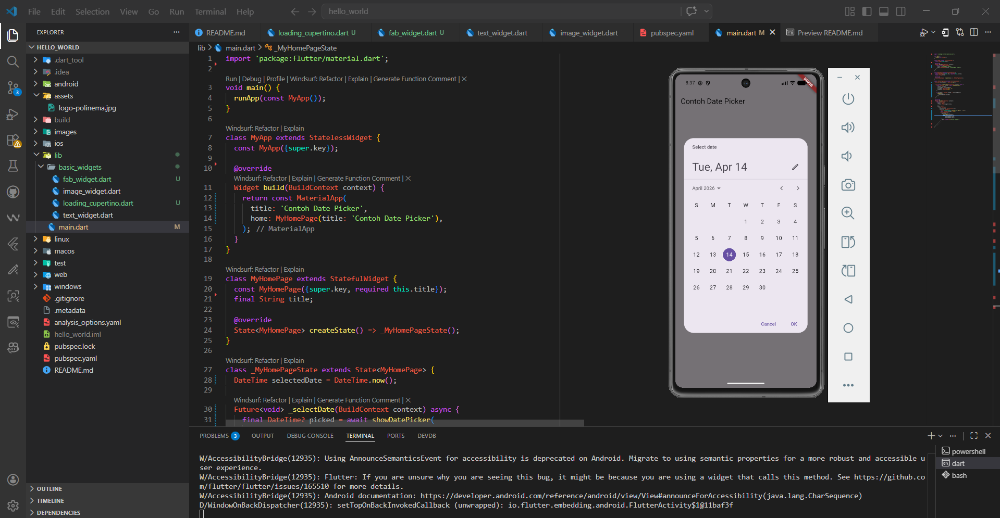

# 📱 Laporan Praktikum Flutter - Hello World

**Nama** : Rojalingga Prana Abinaya  
**Kelas** : SIB 2F  
**No. Presensi** : 16  
**NIM** : 244107060070  

---

# 🚀 Praktikum 1: Membuat Project Flutter Baru

Pada tahap ini, saya berhasil membuat project Flutter pertama dengan nama **hello_world** menggunakan perintah `flutter create`.  
Project ini menjadi dasar untuk seluruh praktikum berikutnya.

📸 Hasil:

---

# 🔌 Praktikum 2: Menghubungkan dengan Emulator

Pada langkah ini, saya menghubungkan project Flutter ke emulator Android.  
Aplikasi berhasil dijalankan menggunakan perintah `flutter run` dan tampil default halaman Flutter.

📸 Hasil:

---

# 🌐 Praktikum 3: Membuat Repository GitHub dan Laporan

Pada tahap ini, saya:
- Membuat repository di GitHub
- Menghubungkan project lokal ke repository
- Melakukan commit dan push
- Mulai menyusun laporan praktikum dalam bentuk dokumentasi

📸 Hasil:

▶️ Proses Run & Debug:

---

# 🧩 Praktikum 4: Menerapkan Widget Dasar

Pada praktikum ini, saya mulai memahami penggunaan widget dasar di Flutter.

### 📝 Text Widget
Menampilkan teks sederhana menggunakan widget `Text`.

📸 Hasil:

---

### 🖼️ Image Widget
Menampilkan gambar dari folder assets menggunakan `Image` dan `AssetImage`.

📸 Hasil:

---

# 🎨 Praktikum 5: Widget Material Design & Cupertino

Pada tahap ini, saya mencoba berbagai widget dari Material Design dan iOS (Cupertino), seperti:
- Button
- Dialog
- Floating Action Button
- Input field
- Date Picker

Hal ini membantu memahami perbedaan tampilan dan penggunaan widget di Flutter.

---

### 📅 Contoh Date Time Picker
Saya berhasil mengimplementasikan fitur pemilihan tanggal menggunakan `showDatePicker`.

📸 Hasil:

---